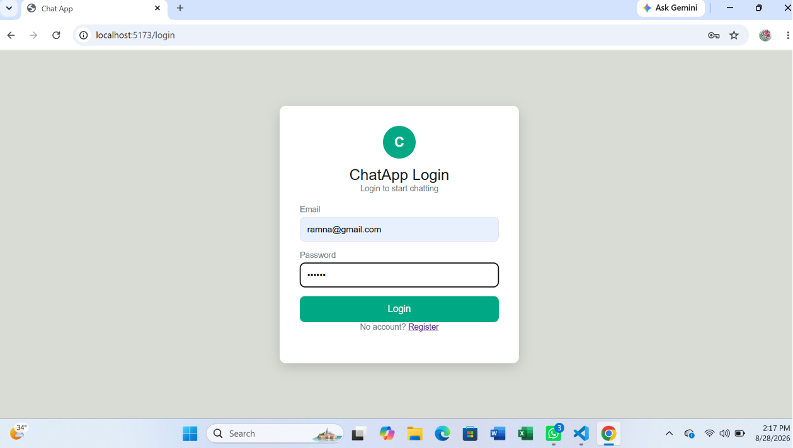
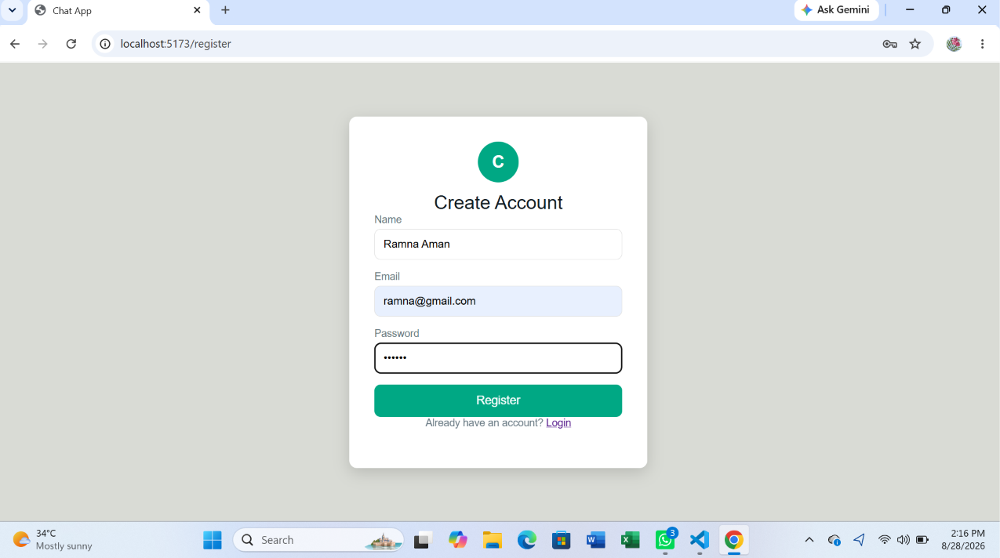
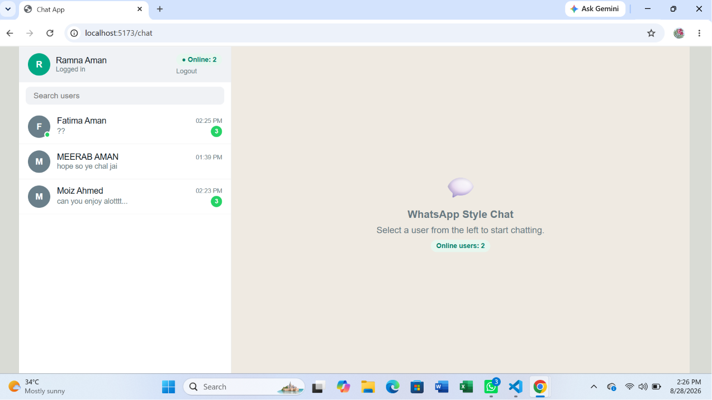

# WhatsApp Style Chat App

A real-time one-to-one chat application built using MERN stack and Socket.IO.

## Technologies

- React JS with Vite
- Node JS with Express
- MongoDB with Mongoose
- Socket.IO
- JWT Authentication
- httpOnly Cookie

## Features

- User registration and login
- JWT-based authentication
- Protected chat page
- User list excluding logged-in user
- Live online user count
- Green online indicator
- One-to-one real-time messaging
- Old messages loaded from MongoDB
- Unread message count
- Unread count becomes 0 when chat is opened
- Blue double ticks for read messages
- Recent message and message time
- Typing indicator
- Responsive mobile layout

## How to Run

### Server

Open terminal:

```bash
cd server
npm install
npm run dev
Server runs on:
http://localhost:3000
Client
Open another terminal:
cd client
npm install
npm run dev
Client runs on:
http://localhost:5173
Environment Variables
Create a .env file inside the server folder.
Use .env.example as a reference.
Never commit the actual .env file to GitHub.

Socket Events :


1.connection :
Connects the browser to the server and authenticates using JWT cookie
2.disconnect :
Removes the user from the online list when all tabs are closed
3.online:count :
Sends the current online user count
4.online:users :
Sends the list of currently online users
5.chat:history :
Loads old messages between two users
6.chat:send :
Sends and saves a new message
7.chat:message :
Delivers a saved message instantly
8.chat:unread :
Gets unread message counts
9.chat:read :
Marks messages as read
10.chat:unread:update :
Updates the unread badge
11.chat:messages:read :
Updates blue read ticks
12.chat:typing :
Shows the typing indicator
Screenshots
## Screenshots

### Login


### Register


### User List


### Chat


### Unread Messages


### Mobile Responsive
